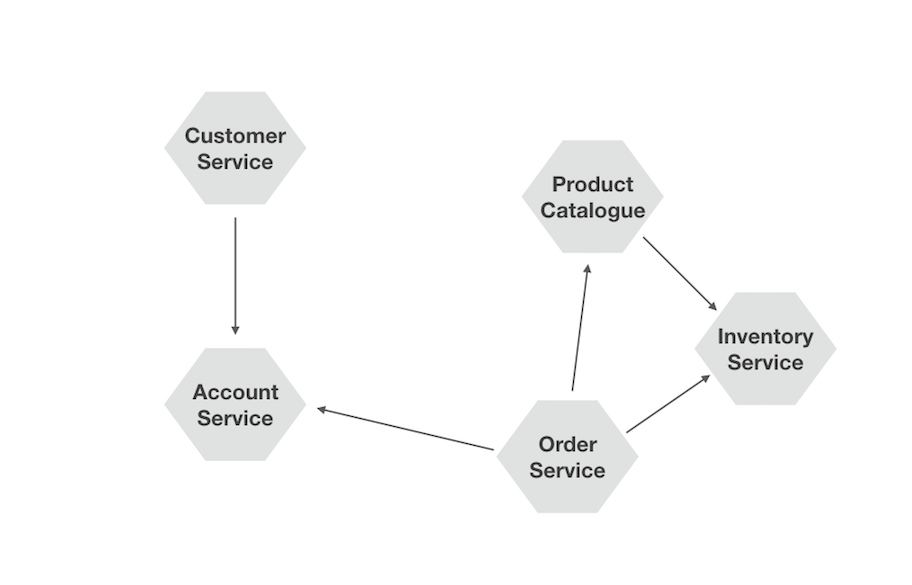

## Introduction to Microservices
James Bowman Sep 2017

---

### Overview

1. Introduction
1. What are microservices?
1. Principles
1. Common challenges

---

### 1. Introduction

Note:
- About me
    - At Argos
    - History
    - Working with Microservices
- Microservice history
    - 2012 Workshop near Vienna

+++

Note:
- An app comprised of collaborating microservices
- Explain Alistair Cockburn's Hexagonal Architecture

---

### 2. What are microservices?

+++

>Fits in my head

-- James Lewis

Note: 
- Fred George claims 100-1000 LOC ()
- Unfortunately named - ***Micro***-service
    - People focus too much on *size*

+++

>Fine grained SOA

-- Adrian Cockroft

Note: 
Lots of people ask - _just SOA done right?_
**Answer**: Yes, but microservices are more 
- **broader in scope**
- **more prescriptive**
    - isolation
    - **No ESB!** or other baggage often implied by SOA
        - [Egregious Spaghetti Box](http://www.infoq.com/presentations/soa-without-esb)

+++

>Replaceable component architecture

-- Dan North

Note:
- Implies **indepence**, **interoperability**, **isolation**
- Narrow in scope

+++

>Small *autonomous* services that *work together*, modelled around a *business domain*

-- Sam Newman

Note:
- Implies **independence**, **interoperability**, **isolation**, **coreography**

+++

### Monolithic vs Polylithic architectures

+++

 | Monolithic | Polylithic
-|------------|-----------
Complexity | low | very high
Cost of change | high | low
Flexibility | low | high

Note:
- **Complexity**
    - **Risk**
        - more moving parts (monitoring)
        - out of process calls (network, firewalls, etc.)
    - **Deployment** - more configuration items to manage (configuration management)
    - **Testing** - more things to test and complex (automation & contact testing)
    - **Operations** - more processes to monitor and manage (automation & monitoring)
- **Cost of change**
    - **impact of changes** easier to understand and limited in scope to component boundary
    - faster and lower risk to **build and deploy** only the changed component
- **Flexibility**
    - **scaling options** - independently scalable
    - **resilient to failure** - inherently more resilient to failure _(ref. human cells)_
    - **diversified (polyglot) technologies** - the right tools for the job
    - **Surface area** - allows more people to work on code without triping over each other
+++

### Why now? A perfect storm

- **DevOps** to manage the complexity (automation & monitoring)
- **CD** to deploy faster and more frequently
- **Containers** _e.g. Docker_ to standardise and scale operation
- etc.

Note:
- What is DevOps?
    - Bringing together Dev and Ops to collaborate and share practices
    - http://devopstopologies.com/ by Matthew Skelton
- CD includes agile/lean processes, **automated testing** and separating deployment from release

---

### 3. Principles

1. Independent
1. Isolated
1. Observable
1. Consistent interface?
1. Sensible, lightweight governance

+++

### 3.1. Independent

- Independently deployable
- no temporal coupling
- Independently scalable
- Independent processes (isolated process spaces)
- Independent technology stacks
- Independently rev'able (versioning)
- Independent codebases
- Independent databases
- managed dependencies through well defined contracts

+++

### 3.2 Isolated

- Isolated from failure
    - Graceful degradation
    - Patterns
        - Bulkheads
        - Circuit Breakers
        - Timeouts
        - Retries 
- Separate process spaces
- Separate business domains (bounded contexts)
    - Isolated from changes/corruption

+++

### 3.3 Observable

- Correlation IDs to tie together requests across services
- Log aggregation (Elastic stack, Splunk)
- Events
- Metrics
- Distributed Tracing/APM
- Health checks

Note:
- Standards really help here - all services need to be consistently observable for holistic picture
    - log formats, logging events/tracing, health check endpoints, etc.
- Lightweight, decentralised governance

+++

### 3.4 Consistent Interface

- REST - Consistent APIs
- HATEOAS - Discoverability
- Containers - standardised handling (for scaling operation)
- Monitoring - see above

+++

### 3.5 Sensible, lightweigh governance

- Set sensible standards to encourage interoperability and scaling operation
- Allow teams freedom to innovate inside those constraints e.g. polyglot technologies
- _'dumb pipes, smart endpoints'_

---

### 4. Common challenges

No such thing as a free lunch

+++

### Consistency and Transactions

- Encapsulate within a single service
- Sagas
    - Events
    - Modelling workflows as finite state machines
    - Eventual consistency
    - Compensating Transactions

Note:
- Examples
    - Requesting holiday from HR
    - Transactions
    - Orders, inventory and accounts (stock levels and monies) 
+++

### Events

- HTTP headers and response codes
- Messaging
    - Over HTTP?
    - STOMP gateways
- ATOM/RSS
- Web sockets
- CQRS and Event Sourcing

+++

### Versioning

- Vesioning as a first class concern
- Approaches
    - Postel's law
    - Parallel running multiple versioned components
    - Handling versioning (and backward support) explicitly in code
- Versioning schemes
    - in URL
    - using content negotiation (HTTP headers)
    - in body

+++

### Testing

- Testability as a first class concern
- How to test configurations if everything is independently rev'able?
- Consumer driven contracts
- Automated testing

+++

### Deploying and Releasing

- Avoid synchronising deployments/releases across services
- see versioning above
- see testing above
- feature toggles
- Decouple deployment from release

---

### References and further reading

Principles of Microservices, Sam Newman - https://www.youtube.com/watch?v=PFQnNFe27kU

Hexagonal Architecture, Alistair Cockburn - http://alistair.cockburn.us/Hexagonal+architecture

Does my bus look big in this, Martin Fowler & Jim Webber - http://www.infoq.com/presentations/soa-without-esb

DDD and Microservices: At Last, Some Boundaries! Eric Evans - https://www.infoq.com/presentations/ddd-microservices-2016

+++

Event Driven Data Management (Sagas), Chris Richardson - 
https://www.nginx.com/blog/event-driven-data-management-microservices/

Sagas, Chris Richardson -
http://microservices.io/patterns/data/saga.html

DevOps Topologies, Matthew Skelton - http://devopstopologies.com/

Microservice Testing, Toby Clemson - https://martinfowler.com/articles/microservice-testing/

+++

ThoughtWorks Tech Radar - https://www.thoughtworks.com/radar/

Your API Versioning is wrong, Troy Hunt - https://www.troyhunt.com/your-api-versioning-is-wrong-which-is/

Microservices, James Lewis & Martin Fowler - https://martinfowler.com/articles/microservices.html

Consumer Driven Contracts, Ian Robinson - https://martinfowler.com/articles/consumerDrivenContracts.html

+++

Continuous Delivery Tool Landscape, James Bowman - http://www.jamesbowman.me/post/continuous-delivery-tool-landscape/

How to GET a cup of coffee, Jim Webber - https://www.infoq.com/articles/webber-rest-workflow

Conway's Law - http://www.melconway.com/Home/Conways_Law.html

Postel's Law (The Robustness Principle) - https://en.wikipedia.org/wiki/Robustness_principle

+++

Awesome Microservices - https://github.com/mfornos/awesome-microservices

The 12 Factor App - https://12factor.net/